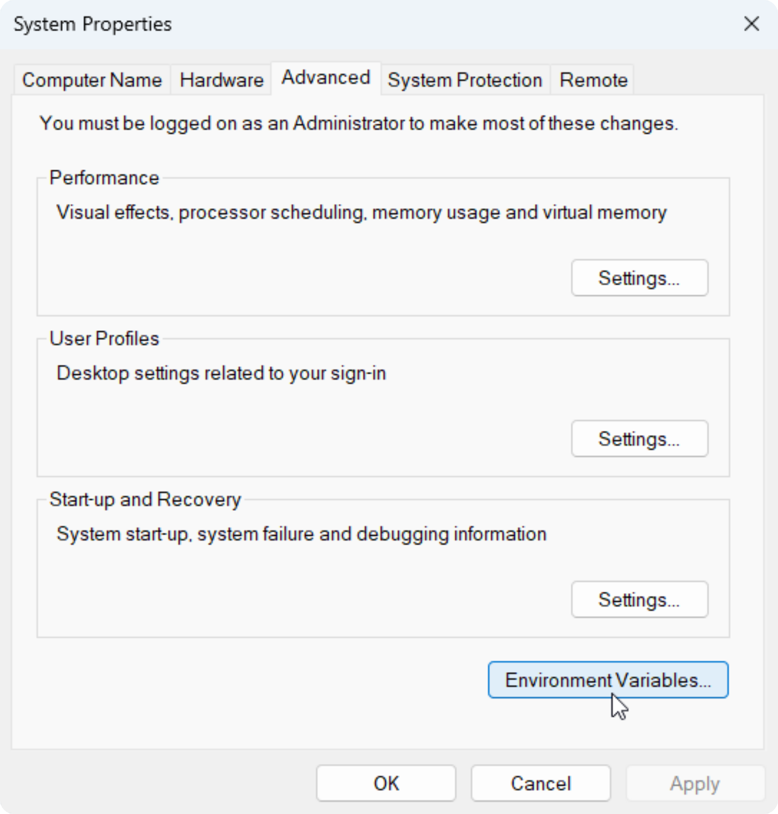
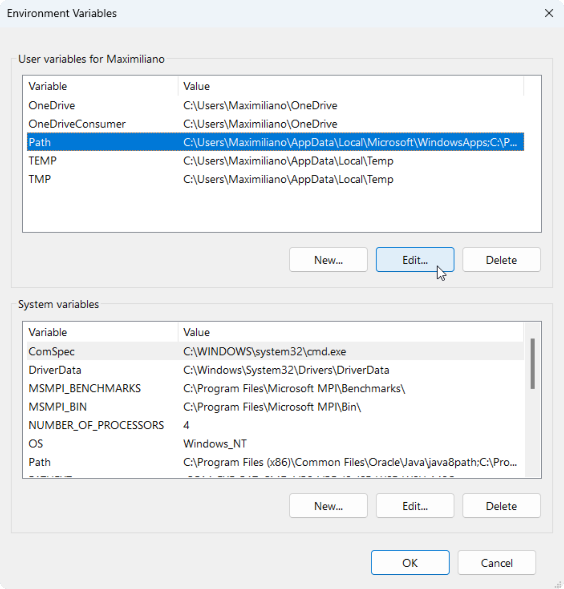
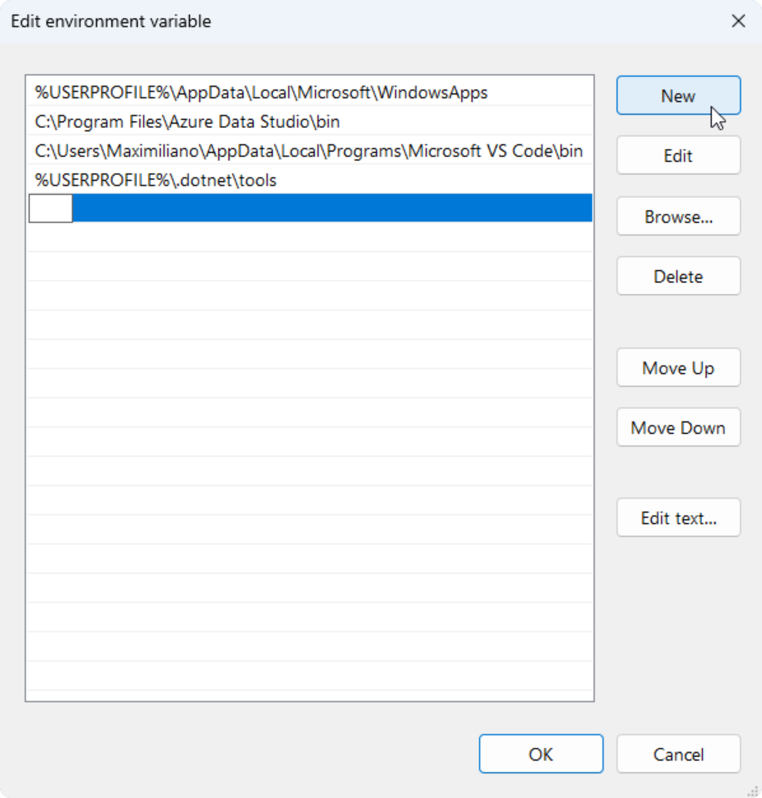

# Variables de entorno

- [Variables de entorno](#variables-de-entorno)
  - [Introducción](#introducción)
  - [Agregar ruta al Path](#agregar-ruta-al-path)

## Introducción

&nbsp;
Las variables de entorno son valores almacenados en el sistema operativo para poder ser usados por programas. El `Path` es una variable de entorno que almacena las rutas donde el sistema busca archivos ejecutables.

## Agregar ruta al Path

1. En inicio, buscar `env`:

    

2. Abrir las variables de entorno:

    

3. Editar el `Path`:

    

4. Agregar una nueva ruta:

    